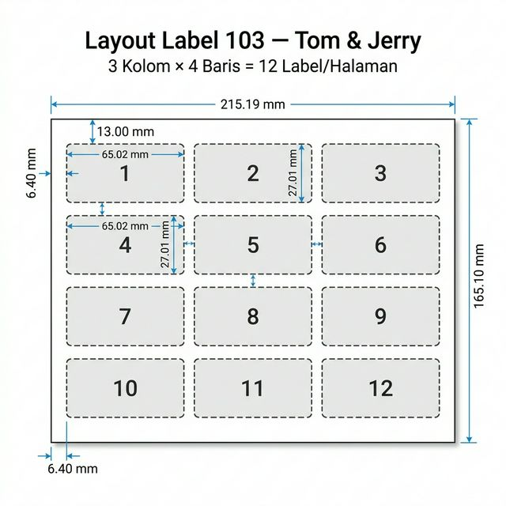
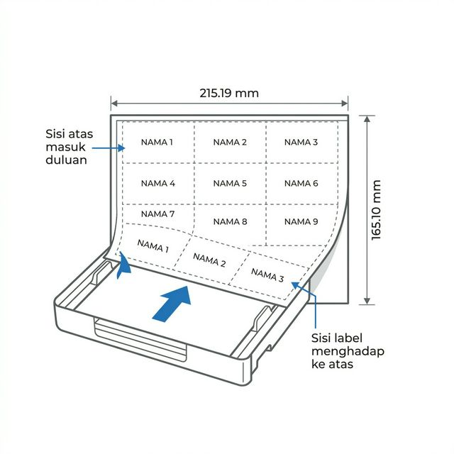

# 📋 Dokumentasi Generator Label Undangan 103

> **Aplikasi web untuk membuat label undangan** menggunakan kertas label **Tom & Jerry 103**.
> Format: **3 kolom × 4 baris = 12 label per halaman**.

---

## 📐 Spesifikasi Kertas Label 103



| Parameter | Nilai |
|---|---|
| **Ukuran halaman** | 215.19 × 165.10 mm (landscape) |
| **Jumlah kolom** | 3 |
| **Jumlah baris** | 4 |
| **Label per halaman** | 12 |
| **Ukuran tiap label** | 65.02 × 27.01 mm |
| **Margin kiri** | 6.40 mm |
| **Margin atas** | 13.00 mm |

### Posisi Label (mm dari tepi kertas)

```
Kolom 1: x = 6.40 mm     Kolom 2: x = 75.58 mm    Kolom 3: x = 144.76 mm
Baris 1: y = 13.00 mm    Baris 2: y = 51.01 mm
Baris 3: y = 89.02 mm    Baris 4: y = 127.04 mm
```

---

## 🚀 Cara Penggunaan

### 1. Input Nama

Ada **2 cara** memasukkan nama:

#### ✍️ Ketik Manual
- Klik tab **"Ketik Manual"**
- Ketik nama undangan, **satu nama per baris**
- Contoh:
  ```
  Bpk. Ahmad Santoso
  Ibu Sari Dewi
  Keluarga Besar Wijaya
  ```

#### 📊 Import Excel / CSV
- Klik tab **"Import Excel / CSV"**
- Klik area upload atau **drag & drop** file `.xlsx` atau `.csv`
- Pilih **kolom** yang berisi nama dari dropdown
- Nama akan otomatis terbaca dan ditampilkan

> ⚠️ **Catatan**: Baris pertama dianggap sebagai header dan akan dilewati.

### 2. Pengaturan Teks

| Pengaturan | Pilihan | Keterangan |
|---|---|---|
| **Ukuran Font** | 5pt – 16pt (default: 9pt) | Font otomatis mengecil jika nama terlalu panjang |
| **Rata Teks** | Kiri / Tengah / Kanan | Posisi horizontal teks di dalam label |
| **Gaya** | Biasa / **Tebal** | Ketebalan huruf |
| **Posisi Vertikal** | Tengah / Atas / Bawah | Posisi vertikal teks di dalam label |

### 3. Preview

- Preview menampilkan **tampilan persis** seperti yang akan tercetak
- Gunakan tombol **← Sebelumnya** dan **Berikutnya →** untuk navigasi antar halaman
- Jumlah halaman = jumlah nama ÷ 12 (dibulatkan ke atas)
- Font otomatis menyesuaikan: **nama panjang = font lebih kecil**

### 4. Export / Download

Ada **2 format** output:

| Format | Tombol | Keterangan |
|---|---|---|
| **PDF** | 📄 Download PDF | Membuka dialog print browser → simpan sebagai PDF |
| **DOCX** | 📝 Download .docx | Langsung download file `.docx` |

### 5. Hapus Data

- Klik tombol **🗑 Hapus** untuk menghapus semua nama dan reset

---

## 🖨️ Panduan Print

### Metode 1: Print via PDF (Direkomendasikan ✅)

1. Klik tombol **📄 Download PDF**
2. Dialog print browser akan terbuka
3. **Pengaturan penting di dialog print:**

   | Pengaturan | Nilai |
   |---|---|
   | **Tujuan/Destination** | Pilih printer atau "Save as PDF" |
   | **Ukuran Kertas** | Custom: **215.19 × 165.10 mm** |
   | **Orientasi** | **Landscape** |
   | **Margin** | **None / Tanpa margin** |
   | **Skala / Scale** | **100%** (jangan "Fit to page") |

4. Klik **Print** atau **Save**

> ⚠️ **PENTING**: Pastikan skala/scale diset ke **100%** dan margin **None**. Jika tidak, posisi label akan geser!

### Metode 2: Print via DOCX

1. Klik tombol **📝 Download .docx**
2. Buka file yang terdownload di **Microsoft Word** atau **WPS Office**
3. Pilih **File → Print**
4. Pastikan pengaturan kertas sama seperti di atas

> ℹ️ Format PDF lebih akurat dibanding DOCX karena posisi menggunakan koordinat absolut (mm).

---

## 📄 Posisi Kertas di Printer



### Langkah memasukkan kertas label:

```
┌─────────────────────────────────────┐
│                                     │
│   ┌───────┐ ┌───────┐ ┌───────┐   │  ← Baris 1 (atas)
│   │ Nama1 │ │ Nama2 │ │ Nama3 │   │
│   └───────┘ └───────┘ └───────┘   │
│   ┌───────┐ ┌───────┐ ┌───────┐   │
│   │ Nama4 │ │ Nama5 │ │ Nama6 │   │
│   └───────┘ └───────┘ └───────┘   │
│   ┌───────┐ ┌───────┐ ┌───────┐   │
│   │ Nama7 │ │ Nama8 │ │ Nama9 │   │
│   └───────┘ └───────┘ └───────┘   │
│   ┌───────┐ ┌───────┐ ┌───────┐   │
│   │Nama10 │ │Nama11 │ │Nama12 │   │
│   └───────┘ └───────┘ └───────┘   │  ← Baris 4 (bawah)
│                                     │
└─────────────────────────────────────┘
          ↓↓↓ MASUK PRINTER ↓↓↓
```

### Aturan posisi kertas:

| Aturan | Detail |
|---|---|
| **Orientasi** | Landscape (sisi panjang = horizontal) |
| **Sisi label** | Menghadap **ke atas** (sisi stiker di atas) |
| **Arah masuk** | Sisi **pendek** masuk duluan ke printer |
| **Tray** | Masukkan ke tray manual (bypass tray) jika ada |

> 💡 **Tips**: Coba print **1 halaman dulu** di kertas biasa, lalu tumpuk dengan kertas label untuk cek apakah posisi sudah pas sebelum print di kertas label asli.

---

## ❓ Troubleshooting

| Masalah | Solusi |
|---|---|
| **Label geser/tidak pas** | Pastikan margin = None, skala = 100%, ukuran kertas = custom 215.19 × 165.10 mm |
| **Pop-up diblokir saat PDF** | Izinkan pop-up untuk situs ini di browser |
| **Font terlalu kecil** | Naikkan ukuran font di pengaturan, atau kurangi panjang nama |
| **Karakter `&` jadi `&amp;`** | Update ke versi terbaru, bug ini sudah diperbaiki |
| **DOCX miring di WPS** | Update ke versi terbaru, font sudah diset eksplisit ke Arial |
| **Tabel DOCX berubah bentuk** | Font auto-shrink sudah diterapkan, pastikan pakai versi terbaru |

---

## 🔧 Spesifikasi Teknis

- **Browser**: Chrome, Edge, Firefox (terbaru)
- **Library**: JSZip v3.10.1 (untuk generate DOCX)
- **Font**: Arial (sans-serif)
- **Format output PDF**: HTML → `window.print()` dengan `@page` CSS
- **Format output DOCX**: OOXML template injection
- **Auto-shrink font**: Teks yang terlalu panjang otomatis diperkecil agar muat di label
- **Tidak perlu server**: Semua proses berjalan di browser (client-side)
